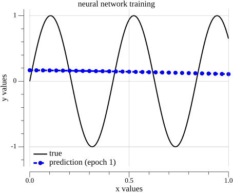
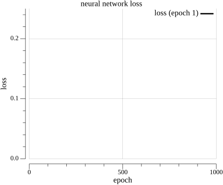
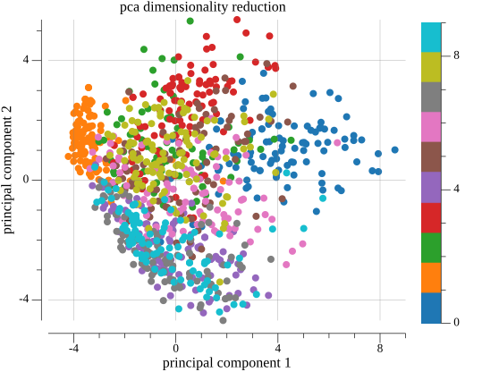
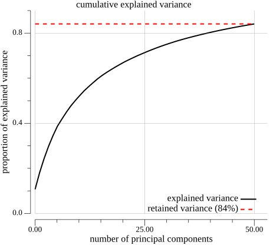

# Deep Feedforward Neural Network (DNN) Code from Scratch Using Golang

A comprehensive deep learning library written in Go from scratch, featuring support for Multi-Layer Perceptron (MLP) Networks, Convolutional Neural Networks (CNN), Hyperparameter Optimization, Mathematical Utilities and Natural Language Processing (NLP).

## 📋 Features

### 🧠 Multi-Layer Perceptron (MLP) Networks
- Fully connected customizable architecture
- Multiple activation functions: Tanh, ReLU, Sigmoid, ELU
- Three training modes:
  - **Regression**: Continuous value prediction
  - **Multiclass Classification**: Multi-class classification problems
  - **Multilabel Classification**: Multiple labels per sample
- Optimizers: Adam, Gradient Descent
- L2 Regularization
- Dropout Regularization
- Mini-batch training with configurable batch size
- Sample shuffling between epochs

### 🖼️ Convolutional Neural Networks (CNN)
- 2D convolutional layers with customizable filters
- Optimized convolution using Im2Col + GEMM
- Max Pooling layers
- Flatten layer for transition to dense layers
- Support for regression, multiclass classification, and multilabel classification
- Multi-channel image support (grayscale, RGB, custom channels)
- Network architecture visualization
- Model export and loading

### 🔍 Hyperparameter Optimization
- **Random Search**: Random search over parameter space
- **Bayesian Optimization**: Advanced Bayesian optimization powered by Goptuna
- **Sampling Functions**: Intelligent hyperparameter exploration with log-uniform and uniform distributions
- Automatic neural architecture exploration
- Model performance comparison
- JSON results export

### 📊 Numerical and Mathematical Utilities (NGO)
- Matrix operations with Gonum
- **StandardScaler**: Feature standardization with Fit/Transform/FitTransform/InverseTransform
- **PCA (Principal Component Analysis)**: Dimensionality reduction with explained variance tracking
- **Convolution**: Im2Col, Col2Im, and FFT-based convolution for large kernels
- **Sampling Functions**: `SuggestInt`, `SuggestFloat`, `SuggestLogFloat` for hyperparameter exploration
- Dense matrix manipulation
- Linear functions (linspace, interpolation)
- Log-uniform and uniform random sampling

### 💬 Natural Language Processing (NLP)
- **Bag of Words (BoW)**: Text vectorization
- **TF-IDF**: Term frequency-inverse document frequency
- Text preprocessing
- Feature extraction for ML models

### 📈 I/O Utilities
- CSV data loading
- Model saving and loading in JSON format
- Model summary generation

## ✨ Highlights

- ✔ Implemented from scratch
- ✔ Written entirely in Go
- ✔ BLAS-accelerated matrix operations (Gonum)
- ✔ Optimized convolution using Im2Col + GEMM
- ✔ Hyperparameter optimization
- ✔ Multi-channel image support
- ✔ Model serialization
- ✔ Natural Language Processing utilities
- ✔ Mathematical utilities (PCA, StandardScaler, Sampling Functions)
- ✔ Mini-batch training with optional data shuffling

## 🎯 Usage Examples

### 1. MLP for Regression

```go
package main

import (
	"github.com/adynascimento/deep-learning/mlp"
	"github.com/adynascimento/deep-learning/nncore"
)

func main() {
	// create model
	neural := mlp.NewNeuralNetwork(mlp.NeuralConfig{
		NNStructure: []int{1, 40, 20, 10, 1},
		Activation:  nncore.TanhActivation,
		Mode:        nncore.ModeRegression,
	})

	// train
	model := neural.NewTrainer(mlp.TrainerConfig{
		Optimizer:    nncore.AdamOptimizer,
		LearningRate: 0.001,
		Epochs:       100},
		mlp.WithBatchSize(32),
		mlp.WithL2Regularization(1.40e-06))
	
	model.Summary()
	model.Fit(xTrain, yTrain)
	model.Save("model.json")

	// make predictions
	yPred := model.Predict(xTrain)
}
```

**Model Summary**:
```
|---------------|--------------|---------|
| LAYER (TYPE)  | OUTPUT SHAPE | PARAM # |
|---------------|--------------|---------|
| Dense Layer 1 | (None, 40)   |      80 |
| Dense Layer 2 | (None, 20)   |     820 |
| Dense Layer 3 | (None, 10)   |     210 |
| Dense Layer 4 | (None, 1)    |      11 |
|---------------|--------------|---------|
```

**Sinusoidal Function Prediction**:
<table>
  <tr>
    <td>
      
    </td>
    <td>
      
    </td>
  </tr>
</table>

**Use case**: Suitable for regression problems such as price prediction, temperature forecasting, time series analysis, etc.

---

### 2. CNN for Image Classification

```go
package main

import (
	"fmt"
	
	"github.com/adynascimento/deep-learning/cnn"
	"github.com/adynascimento/deep-learning/nncore"
)

func main() {
	// create CNN
	neural := cnn.NewConvNeuralNetwork(cnn.CNNConfig{
		InputShape: [3]int{1, 28, 28}, // 1 channel, 28x28
		Activation: nncore.ReLUActivation,
		Mode:       nncore.ModeMultiClass,
	})

	// build architecture
	neural.AddConv2DLayer(16, 3, 1)      // 16 filters 3x3
	neural.AddMaxPooling2DLayer(2, 2)    // Max pooling 2x2
	neural.AddConv2DLayer(32, 3, 1)      // 32 filters 3x3
	neural.AddMaxPooling2DLayer(2, 2)    // Max pooling 2x2
	neural.AddDenseLayer([]int{128, 10}) // Dense layers

	// train
	model := neural.NewTrainer(cnn.TrainerConfig{
		Optimizer:    nncore.AdamOptimizer,
		LearningRate: 0.001,
		Epochs:       20},
		cnn.WithBatchSize(32),
		cnn.WithL2Regularization(1.40e-06))
	
	model.Summary()
	model.Fit(xTrain, yTrain)
	model.Save("networkmodel.json")

	// evaluate
	fmt.Printf("training accuracy: %.4f\n", model.Evaluate(xTrain, yTrain))
	fmt.Printf("testing accuracy:  %.4f\n", model.Evaluate(xTest, yTest))
}
```

**Model Summary**:
```
|----------------------|--------------------|---------|
|     LAYER (TYPE)     |    OUTPUT SHAPE    | PARAM # |
|----------------------|--------------------|---------|
| Conv2D Layer 1       | (None, 16, 26, 26) |     160 |
| MaxPooling2D Layer 1 | (None, 16, 13, 13) |       0 |
| Conv2D Layer 2       | (None, 32, 11, 11) |    4640 |
| MaxPooling2D Layer 2 | (None, 32, 5, 5)   |       0 |
| Flatten Layer        | (None, 800)        |       0 |
| Dense Layer 1        | (None, 128)        |  102528 |
| Dense Layer 2        | (None, 10)         |    1290 |
|----------------------|--------------------|---------|
```

**MNIST Prediction**:
```
epoch     1/20:  100% ━━━━━━━━━━━━━━━━━━━━ (32/32) [0s] | t:  355.33ms | loss: 1.404039e+00 | acc: 0.7510 
epoch     2/20:  100% ━━━━━━━━━━━━━━━━━━━━ (32/32) [0s] | t:  313.77ms | loss: 4.709101e-01 | acc: 0.9110 
epoch     3/20:  100% ━━━━━━━━━━━━━━━━━━━━ (32/32) [0s] | t:  356.54ms | loss: 2.755988e-01 | acc: 0.9450 
epoch     4/20:  100% ━━━━━━━━━━━━━━━━━━━━ (32/32) [0s] | t:  308.44ms | loss: 1.705021e-01 | acc: 0.9640 
epoch     5/20:  100% ━━━━━━━━━━━━━━━━━━━━ (32/32) [0s] | t:  314.44ms | loss: 1.190550e-01 | acc: 0.9870 
epoch     6/20:  100% ━━━━━━━━━━━━━━━━━━━━ (32/32) [0s] | t:  313.54ms | loss: 7.712814e-02 | acc: 0.9920 
epoch     7/20:  100% ━━━━━━━━━━━━━━━━━━━━ (32/32) [0s] | t:  359.03ms | loss: 5.899423e-02 | acc: 0.9980 
epoch     8/20:  100% ━━━━━━━━━━━━━━━━━━━━ (32/32) [0s] | t:  310.95ms | loss: 4.190740e-02 | acc: 0.9980 
epoch     9/20:  100% ━━━━━━━━━━━━━━━━━━━━ (32/32) [0s] | t:  317.58ms | loss: 2.504125e-02 | acc: 0.9990 
epoch    10/20:  100% ━━━━━━━━━━━━━━━━━━━━ (32/32) [0s] | t:  403.54ms | loss: 1.748601e-02 | acc: 1.0000 
epoch    11/20:  100% ━━━━━━━━━━━━━━━━━━━━ (32/32) [0s] | t:  306.53ms | loss: 1.432969e-02 | acc: 1.0000 
epoch    12/20:  100% ━━━━━━━━━━━━━━━━━━━━ (32/32) [0s] | t:  307.43ms | loss: 1.292305e-02 | acc: 1.0000 
epoch    13/20:  100% ━━━━━━━━━━━━━━━━━━━━ (32/32) [0s] | t:  307.17ms | loss: 7.712410e-03 | acc: 1.0000 
epoch    14/20:  100% ━━━━━━━━━━━━━━━━━━━━ (32/32) [0s] | t:  354.81ms | loss: 6.105613e-03 | acc: 1.0000 
epoch    15/20:  100% ━━━━━━━━━━━━━━━━━━━━ (32/32) [0s] | t:  309.86ms | loss: 4.989471e-03 | acc: 1.0000 
epoch    16/20:  100% ━━━━━━━━━━━━━━━━━━━━ (32/32) [0s] | t:  305.67ms | loss: 4.089591e-03 | acc: 1.0000 
epoch    17/20:  100% ━━━━━━━━━━━━━━━━━━━━ (32/32) [0s] | t:  356.38ms | loss: 3.658072e-03 | acc: 1.0000 
epoch    18/20:  100% ━━━━━━━━━━━━━━━━━━━━ (32/32) [0s] | t:  309.64ms | loss: 2.997197e-03 | acc: 1.0000 
epoch    19/20:  100% ━━━━━━━━━━━━━━━━━━━━ (32/32) [0s] | t:  357.45ms | loss: 2.642009e-03 | acc: 1.0000 
epoch    20/20:  100% ━━━━━━━━━━━━━━━━━━━━ (32/32) [0s] | t:  308.07ms | loss: 2.363765e-03 | acc: 1.0000 

accuracy of training data: 1.0000 
accuracy of testing data:  0.9457 
```

**Use case**: Complex image classification, object detection, facial recognition, etc.

---

### 3. Hyperparameter Optimization

```go
package main

import (
	"fmt"
	"strconv"

	"github.com/adynascimento/deep-learning/hyperopt"
	"github.com/adynascimento/deep-learning/mlp"
	"github.com/adynascimento/deep-learning/nncore"
)

func main() {
	// define search space
	space := hyperopt.SearchSpace{
			InputDim:          xTrain.RawMatrix().Rows,
			OutputDim:         yTrain.RawMatrix().Rows,
			NLayersRange:      []int{3, 5},           // minimum and maximum number of layers
			NHiddenRange:      []int{50, 100},        // minimum and maximum number of hidden units per layer
			LearningRateRange: []float64{1e-4, 1e-2}, // minimum and maximum of learning rate
			LambdRange:        []float64{1e-6, 1e-2}, // minimum and maximum of regularization parameter
			NModels:           3,                     // number of models
		})

	// create optimizer
	hp := hyperopt.NewHyperparameterOptimization(space)

	// define objective function
	objective := func(trialID int, params hyperopt.Params) float64 {
		// neural network model
		neural := mlp.NewNeuralNetwork(mlp.NeuralConfig{
			NNStructure: params.NNStructure,    // neural network structure
			Activation:  nncore.TanhActivation, // activation function
			Mode:        nncore.ModeMultiClass, // mode determines output layer activation and loss function
		})

		// optimizer to train the model
		model := neural.NewTrainer(mlp.TrainerConfig{
			Optimizer:    nncore.AdamOptimizer,  // optimizer
			LearningRate: params.LearningRate,   // learning rate
			Epochs:       400},                  // number of iterations
			mlp.WithBatchSize(32),
			mlp.WithL2Regularization(params.L2Regularization),
		)
		model.Fit(xTrain, yTrain, mlp.WithVerbose(false))
		model.Save("./trials/model" + strconv.Itoa(trialID) + ".json")

		// make predictions and evaluate model
		return model.Evaluate(xTrain, yTrain)
	}

    // bayesian optimization
	hp.BayesianOptimization(hyperopt.Maximize, objective)

	// or random search
	hp.RandomSearchOptimization(hyperopt.Maximize, objective)
	
	// get best parameters
	bestParams := hp.GetBestParams()
	fmt.Println("best parameters:", bestParams)
}
```

**Use case**: Automatically find the best network architecture and training parameters.

---

### 4. Data Scaling and Dimensionality Reduction

```go
// feature standardization with StandardScaler
package main

import (
	"github.com/adynascimento/deep-learning/ngo"
)

func main() {
	// create StandardScaler
	scaler := ngo.NewStandardScaler()
	
	// fit on training data
	scaler.Fit(xTrain)
	
	// transform both training and test data
	xTrainScaled := scaler.Transform(xTrain)
	xTestScaled := scaler.Transform(xTest)
	
	// or fit and transform in one step
	xScaled := scaler.FitTransform(x)
	
	// inverse transform to get original scale
	xOriginal := scaler.InverseTransform(xScaled)
	
	// access computed statistics
	means := scaler.GetMean()
	stdDevs := scaler.GetStdDev()
}
```

```go
// principal component analysis for dimensionality reduction
package main

import (
	"github.com/adynascimento/deep-learning/ngo"
)

func main() {
	// create PCA with desired number of components
	pca := ngo.NewPCA(nComponents)
	
	// fit PCA model
	pca.Fit(xTrain)
	
	// transform to reduced dimensions
	xReduced := pca.Transform(xTrain)
	
	// or fit and transform in one step
	xReduced := pca.FitTransform(xTrain)
	
	// reconstruct original space (with information loss)
	xReconstructed := pca.InverseTransform(xReduced)
	
	// get PCA components and explained variance
	components := pca.GetComponents()
	variance := pca.GetExplainedVariance()
}
```

**MNIST - PCA Dimensionality Reduction**:
<table>
  <tr>
    <td>
      
    </td>
    <td>
      
    </td>
  </tr>
</table>

**Use case**: Feature preprocessing, dimensionality reduction, and data compression before training.

---

### 5. Natural Language Processing

```go
// example using NLP
package main

import (
	"github.com/adynascimento/deep-learning/nlp"
)

func main() {
	// Bag of Words
	texts := []string{
		"this is an example of text",
		"another example of processing",
		"text for language analysis",
	}
	
	bow := nlp.NewCountVectorizer(100)
	vectors := bow.FitTransform(texts...)

	// TF-IDF
	tfidf := nlp.NewTFIDFVectorizer(100)
	weights := tfidf.FitTransform(texts...)

	_, _ = vectors, weights
}
```

**Use case**: Text vectorization for ML models, sentiment analysis, document classification.

---

## 🚀 Installation

### Prerequisites
- Go 1.22 or higher
- Gonum (managed by go.mod)

### Steps

Install the package in your Go project:

```bash
go get github.com/adynascimento/deep-learning
```

Then import it:

```go
import (
	"github.com/adynascimento/deep-learning/nncore"
	"github.com/adynascimento/deep-learning/mlp"
	"github.com/adynascimento/deep-learning/cnn"
	"github.com/adynascimento/deep-learning/hyperopt"
	"github.com/adynascimento/deep-learning/ngo"
	"github.com/adynascimento/deep-learning/nlp"
)
```

To run the examples from this repository:

```bash
cd examples/regression
go run regression.go
```

---

## 📦 Main Dependencies

- **Gonum**: Numerical computing in Go  ([github.com/gonum/gonum](https://github.com/gonum/gonum))
- **Goptuna**: Bayesian hyperparameter optimization ([github.com/c-bata/goptuna](https://github.com/c-bata/goptuna))
- **Plot**: Graph visualization and plotting ([github.com/adynascimento/plot](https://github.com/adynascimento/plot))
- **ProgressBar**: Training progress bar ([github.com/schollz/progressbar](https://github.com/schollz/progressbar))
- **TableWriter**: Table formatting for output ([github.com/olekukonko/tablewriter](https://github.com/olekukonko/tablewriter))

---

### Hyperparameter Sampling Functions

For intelligent hyperparameter exploration:

```go
package ngo

// uniform integer sampling [min, max]
learningRateExp := ngo.SuggestInt(1, 5) // e.g., for 0.0001 to 0.00001

// uniform float sampling [min, max]
lr := ngo.SuggestFloat(0.0001, 0.1)

// log-uniform float sampling (better for learning rates and regularization)
lr := ngo.SuggestLogFloat(1e-5, 1e-1) // logarithmically distributed
```

**Use case**: Hyperparameter optimization, random search, Bayesian optimization with Goptuna.

---

## 🎓 Supported Concepts

### Activation Functions
- **Tanh**: Zero-centered activation commonly used in hidden layers
- **ReLU**: Nonlinear activation that keeps positive values and clips negatives to zero
- **Sigmoid**: Maps values to the 0-1 range
- **ELU**: Smooth nonlinear activation with negative outputs for negative inputs
- **Softmax**: For multiclass classification

### Optimizers
- **Adam**: Adapts learning rate per parameter with momentum and squared gradient tracking (recommended)
- **Gradient Descent**: Classic gradient descent with configurable learning rate
- Bias correction for Adam optimizer
- Layer-wise learning rate adaptation

### Regularization
- **L2 (Ridge)**: Penalizes large weights to prevent overfitting
- **Dropout**: Randomly disables neurons during training to reduce overfitting

### Training Modes
- **Regression**: MSE loss, linear output
- **Multiclass**: Cross-entropy loss, softmax
- **Multilabel**: Binary cross-entropy, sigmoid

---

## 🔧 Advanced Configuration

### Batch Training
```go
model := neural.NewTrainer(config,
	mlp.WithBatchSize(32),
	mlp.WithShuffle(true))
```

### Regularization Techniques
```go
model := neural.NewTrainer(config,
	mlp.WithL2Regularization(1e-6),
	mlp.WithDropout(0.4))
```

### Saving and Loading Models
```go
// save model
model.Save("model.json")

// load  model
model := mlp.Load("model.json")
model.Fit(...) // continue training
```

---

## 💡 Recommended Use Cases

| Task | Model | Example |
|------|-----------|----------|
| Continuous value prediction | MLP + Regression | Real estate pricing |
| Image classification | CNN | MNIST, CIFAR-10 |
| Text classification | MLP + NLP | Sentiment analysis |
| Multiple labels | MLP + Multilabel | Product tagging |
| Find optimal parameters | Hyperopt | Architecture tuning |


## 📝 License

This project is licensed under the MIT License. See the [MIT LICENSE](LICENSE) file for details.

---

## 🤝 Contributing

Contributions are welcome! Please open issues or pull requests for improvements.

---

## 📚 Additional Resources

- [Gonum Documentation](https://www.gonum.org/)
- [Deep Learning Fundamentals](https://en.wikipedia.org/wiki/Deep_learning)
- [CNN Architecture](https://en.wikipedia.org/wiki/Convolutional_neural_network)
- [Hyperparameter Optimization](https://en.wikipedia.org/wiki/Hyperparameter_optimization)

---

**Designed to explore deep learning concepts in Go with a simple and intuitive code.**
